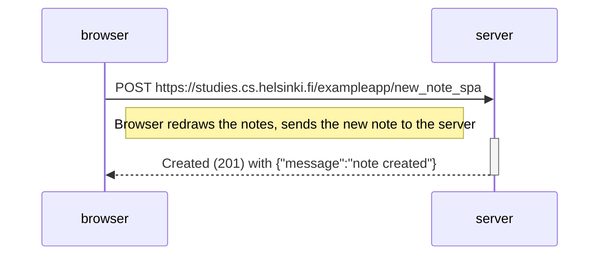

```mermaid

sequenceDiagram

    browser->>server: POST https://studies.cs.helsinki.fi/exampleapp/new_note_spa
    NOTE right of browser: Browser redraws the notes, sends the new note to the server
    activate server
    server-->>browser: Created (201) with {"message":"note created"}
    deactivate server   

```